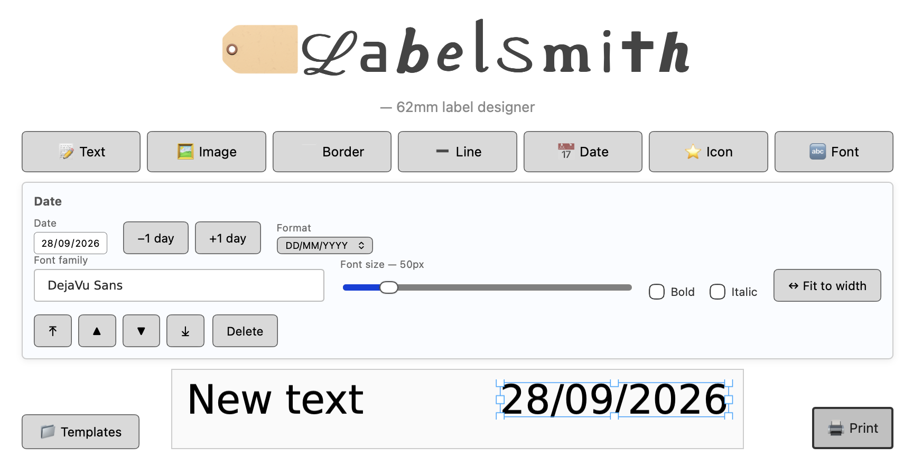

# LabelSmith

A browser-based, drag-and-drop label designer for Brother QL label printers. It runs on a small always-on machine (I use a Raspberry Pi) that the printer is plugged into, and you design and print labels from any phone, tablet or computer on your home network.

It started as a replacement for [brother_ql_web](https://github.com/pklaus/brother_ql_web): instead of a form that renders a single line of text, you get a WYSIWYG canvas where what you see is exactly what prints.



## Features

- **Text** with bold/italic, resize from any handle, and "Fit to width" to make it as large as the label allows
- **Any Google Font**, searchable by name or category and installed on demand
- **Clip art, emoji and icons**: fantasy, animal, space, sea and other clip art, colour or outline emoji, and Material Symbols, all searchable or browsable by category
- **Images**, converted to black and white with an adjustable threshold
- **Dates**: insert today's date, pick one, nudge ±1 day, choose the format. Saved templates reset to today when loaded.
- **Borders and lines**: solid, dashed, dotted and rounded
- **Snapping** to the printable margins, the centre line and other elements while moving or resizing
- **Layering**: bring to front / send to back
- **Centring**: centre an element across or down the label in one tap
- **Undo / redo**: buttons, or Ctrl/Cmd+Z and Ctrl/Cmd+Shift+Z
- **Printer status**: the Print button greys out with a warning when the printer is switched off
- **Templates**: save, load and delete named designs (stored on the server)
- **Installable** as a home-screen app on phones and tablets

## Hardware support

It has been built and tested with a **Brother QL-700 using 62 mm continuous tape**. The editor is currently fixed to the 62 mm width (696 printer dots).

Printing goes through [brother_ql](https://github.com/matmair/brother_ql-inventree), so other QL models *may* work with `--model`, but I haven't tried them, and other tape widths would need changes to the editor.

## Requirements

- Python 3.9 or newer (developed on 3.12)
- A Linux machine with the printer connected over USB, so it shows up as `/dev/usb/lp0`
- Internet access on that machine for font and icon search (the built-in DejaVu Sans font works offline)

## Installation

```bash
git clone https://github.com/teknopartz/label-designer.git
cd label-designer
python3 -m venv venv
venv/bin/pip install -r requirements.txt
```

Make sure the user you'll run it as can write to the printer. On Raspberry Pi OS this usually means being in the `lp` group:

```bash
sudo usermod -aG lp $USER   # then log out and back in
```

## Running

```bash
venv/bin/python run.py file:///dev/usb/lp0
```

Then open `http://<machine-ip>:8014` in a browser.

| Option | Default | Description |
|---|---|---|
| `printer` (required) | | Printer device, e.g. `file:///dev/usb/lp0` |
| `--model` | `QL-700` | Printer model, passed to brother_ql |
| `--label-size` | `62` | Label size identifier, passed to brother_ql |
| `--port` | `8014` | HTTP port |

### Starting automatically on boot

A systemd unit is included in `systemd/label-designer.service`. It assumes the user `pi` and the checkout at `/home/pi/label-designer`, so edit `User=`, `WorkingDirectory=` and `ExecStart=` to match your setup, then:

```bash
sudo cp systemd/label-designer.service /etc/systemd/system/
sudo systemctl daemon-reload
sudo systemctl enable --now label-designer
```

Check the logs with `journalctl -u label-designer -f`.

## Security note

**There is no login.** The server listens on every network interface, and anyone who can reach the port can print, install fonts and edit templates. It's meant for a trusted home network only. Don't expose it to the internet or port-forward it.

## Where things are stored

These are created at runtime and ignored by git, so pulling updates won't overwrite them:

- `app/data/templates/`: saved templates (one JSON file each)
- `app/static/fonts/google/`: installed Google Fonts
- `app/static/icons/`: cached icon SVGs

## External services

Font and icon search call out to third-party services. If one of them goes down, that search stops working, but designing and printing still work.

- Font search and metadata: [google-webfonts-helper](https://gwfh.mranftl.com), with font files downloaded from Google Fonts
- Clip art, emoji and icons: the [Iconify API](https://iconify.design) (each one is cached locally after first use)

## Credits

- [brother_ql_web](https://github.com/pklaus/brother_ql_web) by Philipp Klaus: the original web interface this project replaces. `app/printer.py` is adapted from it.
- [brother_ql](https://github.com/pklaus/brother_ql) and its maintained fork [brother_ql-inventree](https://github.com/matmair/brother_ql-inventree): the printer driver
- [Konva](https://konvajs.org) (MIT): canvas editor
- [DejaVu fonts](https://dejavu-fonts.github.io) (free license): the bundled default font
- [Material Symbols](https://fonts.google.com/icons) (Apache 2.0): icons
- [game-icons.net](https://game-icons.net) by Lorc, Delapouite and contributors ([CC BY 3.0](https://creativecommons.org/licenses/by/3.0/)): clip art
- [Noto Emoji](https://github.com/googlefonts/noto-emoji) by Google (Apache 2.0): colour emoji
- [Fluent Emoji](https://github.com/microsoft/fluentui-emoji) by Microsoft (MIT): outline emoji
- App icon: [Printer icons created by Eucalyp - Flaticon](https://www.flaticon.com/free-icons/printer) ([this icon](https://www.flaticon.com/free-icon/barcode_2170543), [Eucalyp's profile](https://www.flaticon.com/authors/eucalyp))

This project was written with the help of [Claude Code](https://claude.com/claude-code).

## Support

This is a personal project shared as-is. Issues and pull requests are welcome, but I may not get to them quickly, and I can only test with the hardware listed above.

## License

Copyright (C) 2026 Jeremy Ayre

GPL-3.0. See [LICENSE](LICENSE). This project adapts code from brother_ql_web and depends on brother_ql, both of which are GPL-3.0.
